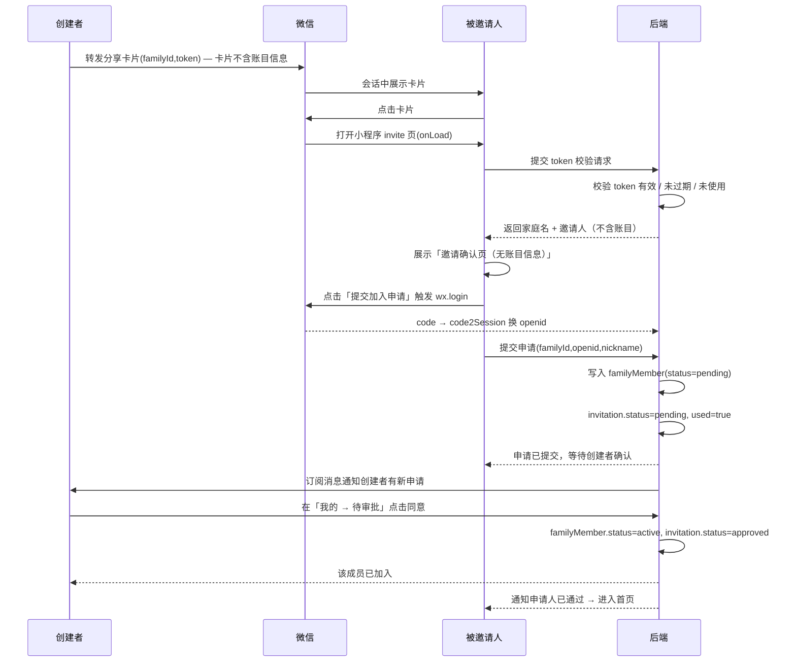
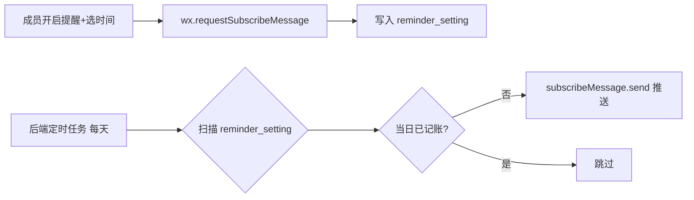

# 家庭共享记账微信小程序 · 设计方案

> 版本：v1.0　|　聚焦：功能范围 / 数据模型 / 交互流程

---

## 1. 产品定位与功能范围

**一句话定位**：创建者发起一个家庭账本，通过微信分享卡片邀请指定微信好友，对方同意后成为家庭成员，所有人共同记录每日收支并共享统计视图。

### 1.1 核心功能范围（MVP）

| 模块 | 功能点 | 说明 |
|------|--------|------|
| 账本创建 | 创建家庭账本 | 首个进入的用户自动成为「创建者」，生成唯一家庭 |
| 邀请加入 | 生成分享卡片、邀请确认 | 仅创建者可邀请；被邀请人需微信授权后同意 |
| 日常记账 | 记一笔（收/支） | 金额、分类、日期、备注、记账人自动归属 |
| 成员管理 | 成员列表、移除、退出、转让创建者 | 创建者专属管理权 |
| 汇总统计 | 总览、分类占比、趋势、成员贡献 | 所有成员可见 |
| 记账提醒 | 每日定时订阅消息 | 到点未记账则推送提醒 |
| 明细查询 | 按日期/分类/成员筛选 | 全量明细可查 |
| 分类与预算 | 自定义收支分类、家庭月预算 | 成员可新增分类（系统预置 + 家庭副本）；创建者设置月度预算，成员端展示「已支出 / 预算」对比与超支提示 |

### 1.2 暂不纳入（v1 之外）

成员间转账结算、多账本切换、导出 Excel、AI 记账（语音/图片识别）、家庭成员关系图谱。

> 注：原列的「预算预警」已在 MVP 内实现（家庭月预算 + 超支提示），故移出「暂不纳入」；其余维持不变。

---

## 2. 用户角色与权限划分

### 2.1 角色定义

- **创建者（Owner）**：家庭账本的发起者，拥有完整管理权，唯一可邀请/移除成员、修改账本设置、转让权限。
- **成员（Member）**：经邀请同意后加入，可记账、查看统计，仅能编辑/删除自己记的账。

### 2.2 权限矩阵

| 功能 | 创建者 | 成员 |
|------|:----:|:----:|
| 邀请新成员 | ✅ | ❌ |
| 移除成员 | ✅ | ❌ |
| 退出家庭 | ❌* | ✅ |
| 转让创建者身份 | ✅ | ❌ |
| 修改账本名称/币种/头像 | ✅ | ❌ |
| 记一笔（收/支） | ✅ | ✅ |
| 编辑/删除**自己**的记录 | ✅ | ✅ |
| 编辑/删除**他人**的记录 | ✅ | ❌ |
| 查看汇总与统计视图 | ✅ | ✅ |
| 导出/清空账本 | ✅ | ❌ |

> *创建者需先转让身份后才能退出，避免出现「无主家庭」。

### 2.3 身份识别

- 通过 `wx.login()` 获取 `code` → 后端 `code2Session` 换取 `openid`（家庭内唯一标识）。
- 同一微信用户仅能以单一身份存在于一个家庭中（一个 openid 对应一条 familyMember 记录）。

---

## 3. 家庭共享账本 · 数据模型

> 推荐后端：**自托管后端 + 关系型数据库（MySQL 8）**，详见 §3.2 数据库表设计（完整建表脚本见《流年小账 · 接口定义与数据库 SQL》§三）；金额一律以**整数「分」**存储（`amount` 字段），避免浮点误差。

### 3.1 实体关系

```
User ──< FamilyMember >── Family ──< Transaction
   │                         │            │
   └──< Invitation >─────────┘            └──< Category
Family ──< ReminderSetting
```

### 3.2 数据库表设计（MySQL 8）

> 采用关系型数据库 MySQL 8；金额一律以**整数「分」**存储；身份以微信 `openid` 为主键。完整建表脚本（含索引、字符集 utf8mb4、InnoDB 引擎）见《流年小账 · 接口定义与数据库 SQL》§三，需由后端**提前在数据库中执行**。此处给出 7 张表的实体说明与字段要点。

#### `user`（用户）
| 字段 | 类型 | 说明 |
|------|------|------|
| id | BIGINT | 自增主键 |
| openid | VARCHAR(64) | 微信 openid，唯一 |
| unionid | VARCHAR(64) | 开放平台 unionid（可选） |
| nickname | VARCHAR(64) | 微信昵称 |
| avatar | VARCHAR(512) | 头像地址 |
| created_at | DATETIME | 创建时间 |

#### `family`（家庭账本）
| 字段 | 类型 | 说明 |
|------|------|------|
| id | VARCHAR(32) | 家庭 ID |
| name | VARCHAR(64) | 账本名称，如「流年小账」 |
| creator_openid | VARCHAR(64) | 创建者 openid |
| currency | VARCHAR(8) | 币种，默认 `CNY` |
| avatar | VARCHAR(512) | 账本封面（可选） |
| member_count | INT | 成员数（冗余，便于展示） |
| status | VARCHAR(16) | `active` / `archived` |
| created_at | DATETIME | 创建时间 |

#### `family_member`（家庭成员关系）
| 字段 | 类型 | 说明 |
|------|------|------|
| id | VARCHAR(32) | 关系 ID |
| family_id | VARCHAR(32) | 所属家庭 |
| openid | VARCHAR(64) | 成员微信 openid |
| nickname | VARCHAR(64) | 家庭内显示昵称 |
| avatar | VARCHAR(512) | 头像 |
| role | VARCHAR(16) | `owner` / `member` |
| status | VARCHAR(16) | `pending`(申请中) / `active` / `removed` |
| source | VARCHAR(16) | 加入来源：`invite`(邀请) / `self`(自己创建) |
| joined_at | DATETIME | 加入时间 |

> 唯一约束 `(family_id, openid)` 防止同一 openid 重复加入同一家庭。

#### `invitation`（邀请记录）
| 字段 | 类型 | 说明 |
|------|------|------|
| id | VARCHAR(32) | 邀请 ID |
| family_id | VARCHAR(32) | 目标家庭 |
| inviter_openid | VARCHAR(64) | 邀请人 |
| token | VARCHAR(64) | 邀请令牌（唯一，分享卡片/小程序码携带） |
| type | VARCHAR(16) | `share`(分享卡片) / `qr`(小程序码) |
| used | TINYINT | 是否已被使用（一次性） |
| applicant_openid | VARCHAR(64) | 申请人 openid（提交申请后写入） |
| reviewed_by | VARCHAR(64) | 审批人 openid（创建者） |
| reviewed_at | DATETIME | 审批时间 |
| expire_at | DATETIME | 过期时间（创建时 = now + 7 天） |
| status | VARCHAR(16) | `pending` / `approved` / `rejected` / `expired` |
| created_at | DATETIME | 创建时间 |

#### `transaction`（收支记录）
| 字段 | 类型 | 说明 |
|------|------|------|
| id | VARCHAR(32) | 记录 ID |
| family_id | VARCHAR(32) | 所属家庭 |
| openid | VARCHAR(64) | 记账人 openid |
| type | VARCHAR(16) | `income`（收）/ `expense`（支） |
| amount | INT | 金额（分，正整数） |
| category_id | VARCHAR(32) | 分类 ID |
| category_name | VARCHAR(32) | 分类名称（冗余，防分类改名后历史失真） |
| date | DATE | 业务日期 `YYYY-MM-DD` |
| note | VARCHAR(200) | 备注（≤200 字） |
| images | JSON | 小票/凭证图地址数组（可选） |
| created_at | DATETIME | 记录时间 |
| updated_at | DATETIME | 最后修改 |

> 索引 `(family_id, date)` 为统计按日期聚合主索引；`(family_id, openid)` 用于按成员筛选。

#### `category`（收支分类）
| 字段 | 类型 | 说明 |
|------|------|------|
| id | VARCHAR(32) | 分类 ID |
| family_id | VARCHAR(32) | 归属家庭（`global` 表示系统预置） |
| name | VARCHAR(32) | 分类名，如「餐饮」「工资」 |
| type | VARCHAR(16) | `income` / `expense` |
| icon | VARCHAR(32) | 图标标识 |
| sort | INT | 排序 |
| is_system | TINYINT | 是否系统预置（不可删） |

#### `reminder_setting`（提醒设置）
| 字段 | 类型 | 说明 |
|------|------|------|
| id | VARCHAR(32) | 设置 ID |
| family_id | VARCHAR(32) | 家庭 |
| openid | VARCHAR(64) | 成员 |
| enabled | TINYINT | 是否开启提醒 |
| time | TIME | 提醒时间 `HH:mm` |
| tmpl_id | VARCHAR(64) | 已订阅的订阅消息模板 ID |
| last_sent_at | DATETIME | 上次推送时间（防重复） |

> 完整 `CREATE TABLE` 建表 SQL 见《流年小账 · 接口定义与数据库 SQL》§三，需由后端在数据库中**提前执行**。

## 4. 收支记录字段规范

一笔记录 = **「谁，在哪天，收/支了多少，归到哪类，记了什么」**。

| 字段 | 交互来源 | 规则 |
|------|----------|------|
| 金额 amount | 用户输入数字键盘 | 必填，>0，以元输入、以分存储 |
| 类型 type | 顶部「支出/收入」切换 | 必填 |
| 分类 category | 分类图标网格 | 必填，按 type 过滤 |
| 日期 date | 默认今天，可改 | 必填，支持补记历史 |
| 备注 note | 文本框 | 选填 |
| 记账人 openid | 系统自动取当前用户 | 不可改，统计时按此聚合 |

附加：可上传小票图片（增强可信度，v1 可选）。

分类来源：系统预置分类（`family_id='global'`）与家庭成员自定义分类（新增写入本家庭副本）合并展示；`category_id` 既可取预置也可取自定义，历史记录冗余 `category_name` 防改名失真（见 §3.2 / 接口 §2.9）。

---

## 5. 首次进入：创建家庭 / 加入家庭

### 5.1 落地页（用户首次打开小程序）

用户（无论将来是创建者还是成员）第一次打开小程序，**不应直接进入某个账本的首页**，而先落到一个中性的起步页，二选一：

| 操作 | 行为 | 后续 |
|------|------|------|
| **创建家庭账本** | 弹出输入框填写家庭名称（如「流年小账」），提交后写入 `family`，当前用户置 `role=owner` | 进入首页（此时账本为空，引导记第一笔） |
| **加入已有家庭** | 提示「请到微信会话中点击家人发来的邀请卡片」；用户点开卡片后由小程序深链进入邀请确认页 | 走第 6 节的申请 + 确认流程 |

关键约束：

- **不能在此页自行搜索/加入他人家庭**——小程序无法获取好友列表，加入的唯一入口是「收到并点开邀请卡片」，避免陌生人凭家庭名乱加。
- 落地页为**独立页**（无底部 TabBar、无记账悬浮按钮），因为此时用户还没有任何账本。
- 登录时机：进入小程序即静默 `wx.login` 取得 openid，但**不写入任何家庭关系**，直到用户完成「创建」或「申请加入」。
- 若用户已是某家庭成员，则跳过落地页直接进首页（`familyMember` 有记录即判定）。

### 5.2 已加入成员再次打开

直接进入上次所在家庭的首页（v1 仅支持单一家庭，无需账本切换）。

---

## 6. 邀请同意流程（微信分享卡片 + 授权确认）

### 6.1 分享机制

- 创建者点击「邀请家人」→ 后端生成 `invitation`（token + 7 天过期）。
- 通过 `<button open-type="share">` 触发转发，在 `onShareAppMessage` 中配置：
  - `title`：`「流年小账」邀请你一起记账`
  - `path`：`/pages/invite/invite?familyId=xxx&token=xxx`
  - `imageUrl`：账本封面或自定义邀请图。
- 被邀请人在微信会话中点击卡片 → 小程序以该 `path` 启动 → `onLoad(query)` 拿到 `familyId` + `token`。

### 6.2 授权与确认时序



### 6.3 隐私与授权合规

- 昵称/头像：用 `<button open-type="chooseAvatar">` + `<input type="nickname">` 头像昵称填写能力获取（**注意**：官方 `wx.getUserProfile` 自 2022-04-28 起已收回，不再依赖，仅保留 `chooseAvatar` + 昵称输入框方案）。
- 手机号：`getPhoneNumber` 仅企业主体可用，本方案不强制，openid 已足够标识身份。
- 隐私协议：需配置 `privacy.json` 并调用 `wx.requirePrivacyAuthorize` 完成隐私授权，符合《个人信息保护法》。

### 6.4 边界情况

- token 过期/已使用 → 提示「邀请已失效，请重新邀请」。
- 已是成员 → 直接进首页，不重复写入。
- 拒绝授权 → 停留确认页，可重新触发。
- 已有 pending 申请 → 提示「申请审核中，请勿重复提交」。

### 6.5 隐私保护与防滥用（重要）

这是本方案相对初版的关键升级，解决「分享卡片泄露账目」与「链接被转发后陌生人直接加入」两类风险。

**一、分享卡片零账目信息**
- 卡片仅展示：家庭名称 + 邀请人昵称 + 泛化文案（如「邀请你加入家庭账本」）。
- **绝不携带**金额、成员数、明细、统计等任何账目信息。
- 原因：小程序分享卡片可被聊天气泡里的任何人看到，且可被**二次转发**，一旦写入账目即为泄露。

**二、邀请链路全程不出现账目信息**
- 邀请确认页（卡片落地页）同样不展示任何账目数字，仅呈现：邀请人（头像/昵称/创建者标签）、已有成员头像、以及「提交加入申请 / 暂不加入」两个操作。
- **页面不再出现「不展示任何账目信息」之类的说明性提示语**——保护策略应由产品行为体现（确实不给看），而不是靠文字反复强调；提示语反而会让页面显得啰嗦、也暗示了「本来可以看到账目」。
- 该页是**独立深链页**：不显示底部 TabBar 与记账悬浮按钮（此时申请人尚未成为成员，不应出现任何记账入口）。
- 同理，分享卡片与邀请弹层中也不写「卡片不含账目信息」这类提示，卡片只保留家庭名称 + 邀请人昵称 + 泛化文案。

**三、审批通过后进入欢迎页（不直接叠加账目）**
- 审批通过后，申请人落地到一个**零账目的欢迎页**（「已加入 XX 家庭账本」+ 成员头像 + 「进入账本」按钮），而不是直接跳到带「本月结余 / 收支」的首页。
- 目的：让「加入」这个动作有一个干净的确认落点，账目数据在用户主动进入账本后才呈现。
- 该页同样是独立页（不显示底部 TabBar 与记账悬浮按钮）。

**四、把「点击即加入」降级为「提交申请 + 创建者确认」**
- 点卡片不再直接成为成员，而是生成一条 `familyMember(status=pending)` 申请。
- 创建者在「我的 → 待审批申请」中**同意 / 拒绝**，同意后才置 `active`。
- 这是防滥用的核心：即使链接被转发到群，陌生人最多提交一条**申请**，看不到任何数据；创建者掌握最终决定权。

**五、配套约束（缺一不可）**
- **token 一次性 + 有效期**（24h~7 天）：用后作废，过期需重新邀请。
- **可撤销**：创建者可随时作废当前邀请链接。
- **人数上限**（如 ≤10）：防止被批量灌入。
- **通知**：有新申请 → 订阅消息通知创建者；审批结果 → 通知申请人。避免创建者漏看。
- **防骚扰**：拒绝后对申请人 openid 临时拉黑（如 24h），避免反复申请。

**六、历史账目可见性（容易被忽略）**
- 审批通过 ≠ 可以让新成员看到全部历史账目。建议**新成员默认只能查看「加入时间之后」的账目**，查看历史需创建者显式授权；否则「审批通过」等于一次性泄露全部历史。

**七、为什么不用「仅指定某个微信用户」**
- 小程序**无法获取好友列表**，分享行为是广播式的，服务端无法预先绑定目标 openid。因此在该平台约束下，**「申请 + 创建者确认」是最可靠、最可控的方式**，而非过度设计。

> 结论：卡片不带账目信息 → 必做；申请+确认 → 建议做，并做成「默认开启、创建者可在设置中关闭」的轻量开关（家庭成员彼此熟悉时可关闭以减少摩擦），但 token 一次性/有效期/人数上限应始终开启。

---

**八、面对面扫码邀请（小程序码）**

除「分享给好友」外，线下面对面邀请更自然的做法是**小程序码（二维码）**：创建者在邀请弹层切到「面对面扫码」，展示一张带参数的小程序码，家人用微信「扫一扫」即进入「提交加入申请」流程，与分享卡片等效。

- **生成方式**：后端调用 `getwxacodeunlimit`（接口 B，永久有效、数量不限），参数 `path=邀请页`、`scene=inviteCode=INV_xxx`；前端展示返回的码图。
- **扫码落地**：邀请页 `onLoad` 用 `decodeURIComponent(options.scene)` 取出邀请码，查邀请记录后展示申请页（沿用「申请 + 创建者确认」流程）。

**关于「未认证不能用」的澄清（关键）**：扫码与分享卡片一样，前提是小程序**已发布**；而「未发布」的根因通常是**主体未完成认证**。需区分：
- **个人主体**：注册即实名（身份证 + 银行卡），**无需 ¥300 微信认证**即可发布并使用小程序码 / 分享给好友。个人开发者基本不受「认证」影响。
- **企业 / 组织 / 个体户**：需先完成**微信认证（¥300/年，个体户 ¥30）**才能提交审核发布；认证前既不能分享卡片、也不能出小程序码。

**未发布 / 未认证时的过渡方案**：
- 把家人加为「**体验成员**」（后台 → 成员管理），用**体验版**二维码给他们扫——仅限已添加的人、带水印、不可外传，家庭几人够用，无需等认证。
- 开发者工具「预览」码：仅你自己调试。
- 注意：普通二维码（第三方工具）直跳小程序，同样要「已发布 + 后台开启『扫普通链接二维码打开小程序』」，并不省事。

> 结论：面对面扫码是推荐补充方式；真正的硬门槛是「发布」，而发布对个人免费实名即可、对企业需认证。原型已在邀请弹层加入「分享给好友 / 面对面扫码」切换，扫码面板含小程序码占位、邀请码与有效期。

---

## 7. 成员管理

- **待审批申请**（仅创建者）：查看申请人昵称/头像/邀请来源，执行「同意 / 拒绝」。

- **成员列表**：单卡片分组展示（发丝线分隔），每行含头像、昵称、角色标签、本月记账笔数。
- **成员详情/操作**：点击成员行弹出底部操作层 —— 展示该成员「本月 / 累计记账笔数」；
  - 自己：修改我的昵称；
  - 创建者看他人：转让创建者 / 移出家庭；
  - 普通成员看他人：仅提示「仅创建者可管理成员」（不暴露管理入口）。
- **移除成员**（仅创建者）：将 `familyMember.status` 置 `removed`，其历史记录保留（账本完整性），但不再能记账；若该成员正被明细/统计页筛选，自动回退到「全部」。
- **退出家庭**（成员）：自己退出，记录置 `removed`；创建者不可直接退出，须先「转让创建者」。
- **转让创建者**（仅创建者）：选择一名 `active` 成员 → 原 owner 降为 member、新 owner 升为 owner。转让后原创建者方可退出。
- **修改昵称/头像**：成员可改自己在家庭内的展示信息。

---

## 8. 账目汇总与统计视图

### 8.1 首页总览（当月）

- 本月收入 / 支出 / 结余 三数字卡，卡内附「本月每日支出」迷你趋势线（点击整卡进入统计页）。
- 本月预算进度：已支出 / 家庭月预算对比，超支以红色标记（预算由创建者设置，未设置则不展示；接口 §2.10）。
- 今日三栏：已记账笔数 / 支出 / 收入。
- 「最近 5 天」流水：以今天为基准的 5 天窗口（不限定本月，跨月时自动跨），按日期分组、同日按时间倒序，每组底部给当日「收 / 支 / 结余」小计。
- 「+ 记一笔」悬浮按钮（居中悬浮，不占 tab）。

### 8.2 统计页

**筛选器（作用于本页全部图表与汇总卡）**

- **时段切换**：`按月`（月份选择器）｜`按年`（年份下拉）｜`自定义`（起止日期）。
- **成员筛选**：全部 / 指定成员，可与时段叠加。

| 视图 | 维度 | 图表 |
|------|------|------|
| 时段汇总 | 所选时段 | 收入 / 支出 / 结余 三数字卡 |
| 支出趋势 | 按日 / 按月（跨度 > 40 天自动按月聚合） | 单线折线 + 渐变面积 |
| 分类占比 | 按 category | 环形饼图（筛选单人时仅显示该成员构成） |
| 成员贡献 | 按成员 | 柱状图（各成员支出额） |
| 同比/环比（可选） | 本期 vs 上期 | 数字对比 + 涨跌标记（遵循国内习惯：涨红跌绿） |

图表标题需带时段与筛选条件（如「支出分类占比（2026年9月）」），避免误读。

### 8.3 明细页

- 时间倒序列表，支持按 **日期区间 / 类型 / 分类 / 成员** 组合筛选。
- 点开单笔可编辑/删除（受限上述权限）。
- 顶部月份切换器，按月聚合小计。

> 统计查询建议由后端按 `family_id + date` 聚合（如 SQL `GROUP BY`）后返回汇总结果，避免小程序端拉全量。

---

## 9. 每日记账提醒机制

### 9.1 技术链路

1. 成员在「提醒设置」开启并选择时间（如 21:00）→ 调用 `wx.requestSubscribeMessage({ tmplIds })` 申请订阅。
2. 后端**定时任务（cron）**每天扫描 `reminder_setting` 中 `enabled=1` 且 `time` 匹配的记录。
3. 对每位成员：若当日该家庭已存在交易则跳过；否则调用 `subscribeMessage.send` 推送「今天还没记账哦」模板消息，深链到记账页。



### 9.2 注意事项

- 小程序**订阅消息需用户主动订阅**；一次性订阅用尽后需重新授权，可在记账成功页适时引导「订阅明日提醒」。
- 长期订阅仅限政务/医疗等类目，家庭记账走一次性订阅更稳妥。
- 推送时间尊重用户设置，提供「开启/关闭」与「时间可调」，避免打扰。

---

## 10. 推荐技术架构

- **前端**：微信原生小程序（或 Taro/uni-app 跨端），页面：首页、记账、统计、明细、成员、邀请确认、设置。
- **后端**：自托管服务（如 Java Spring Boot / JDK17）+ **MySQL 8** 关系型数据库 + Redis（会话/缓存），部署于自有云服务器；对外提供 **REST JSON** 接口，详见《流年小账 · 接口定义与数据库 SQL》。
- **接口形态（REST API）**：`POST /login` 换取会话 token；其余接口请求头带 `Authorization: Bearer <token>`。核心资源：
  - 账本：`POST /family`、`GET /family/:id`、`PATCH /family/:id`
  - 邀请/审批：`POST /invitation`、`GET /invitation/:token`、`POST /invitation/:token/apply`、`GET /family/:id/pending`、`.../approve`、`.../reject`
  - 记账：`POST /transaction`、`PUT/DELETE /transaction/:id`、`GET /transactions`
  - 统计：`GET /stats`
  - 成员：`GET /family/:id/members`、`DELETE .../member/:mid`、`POST .../transfer`、`POST .../quit`
  - 提醒：`GET/PUT /reminder`；小程序码：`GET /wxacode`
- **安全模型**：微信 AppSecret 仅服务端持有；token 由服务端签发，解析得到 `openid` 并校验其是否为目标家庭的 `active` 成员；所有写操作服务端二次校验角色（创建者/成员）与数据归属，杜绝越权。
- **部署形态**：开发期前端可在开发者工具勾选「不校验合法域名」直连 `http://<公网IP>:<端口>/api`；生产需**已备案域名 + HTTPS + 微信后台配置合法域名**。（详见《部署输入与内容核对清单》。）

---

## 11. 关键设计取舍

1. **金额用「分」整数**：杜绝浮点计算的几分钱误差。
2. **分类名冗余进 transaction**：分类改名后历史记录不失真。
3. **成员移除保留记录**：账本连续性优先于「清爽」。
4. **openid 作身份主键**：无需手机号也能唯一标识，降低隐私合规成本。
5. **统计走后端聚合**：家庭数据量增长后，前端拉全量会卡顿。

---

## 12. 隐私合规：微信头像/昵称获取（自动识别家庭成员）

为合规获取微信昵称、头像用于识别家庭成员，需在「代码 + 平台」两侧同时落地。

### 12.1 小程序内（代码层）
1. **首次进入隐私授权弹窗**：用户首次打开小程序即弹出居中授权对话框，含【查看隐私政策】【同意】【拒绝】。未同意前拦截进入主界面（拒绝仅提示，不允许进入）。
2. **隐私政策页（独立页面）**：弹窗可跳转查看；同时在「我的 → 家庭设置 → 隐私政策」常驻入口，随时可查。

弹窗文案：
> 欢迎使用流年小账。本小程序会获取你的微信昵称、头像，用于识别家庭成员；记账数据仅家人可见，不会对外共享。请阅读《隐私政策》，同意后继续使用。

### 12.2 隐私政策要点（已写入小程序内页面）
1. **收集信息**：仅在你授权同意后获取微信昵称、微信头像，用于识别家庭成员；**不会收集**手机号、地理位置、相册、通讯录等其他个人信息。
2. **存储与使用**：记账数据、微信昵称头像存储于服务端数据库（MySQL）；仅你和你添加的家庭成员可查看，不向任何第三方出售、转让、共享。
3. **信息管理**：可随时删除自己的记账记录；如需清除微信信息，联系小程序管理员处理。
4. **信息安全**：依托服务端鉴权（token + 家庭/角色校验）与数据库访问权限防越权；但互联网环境无法保证绝对安全。
5. **未成年人**：面向家庭成年人使用，不主动收集未成年人信息。
6. **联系我们**：隐私疑问联系管理员（占位邮箱 xxx@shturl.）。
7. **政策更新**：变更后在小程序内更新展示。

### 12.3 公众平台后台（需人工在 MP 后台配置，代码无法替代）
- 微信公众平台 → 小程序 → **设置 → 服务内容声明 / 用户隐私保护指引**：填写并提交《隐私保护指引》，勾选「收集微信昵称、头像」等，与代码内声明保持一致。
- 提交后需平台审核，审核通过后方可调用 `button open-type="chooseAvatar"` 等接口获取用户信息（`wx.getUserProfile` 已收回，不再使用）。
- 确保《隐私政策》页面路径在小程序内可访问，且首次弹窗逻辑与平台声明一致。

### 12.4 实现要点（原型已落地）
- **首启拦截**：未同意前 `privacyMask` 覆盖全屏并拦截所有交互；拒绝仅提示、不关闭。
- **授权状态持久化**：同意后写入 `localStorage`（真机改为服务端用户表 `user`），刷新不再重复弹窗；原型另提供「重置隐私弹窗」便于演示复现。
- **两大入口**：弹窗【查看隐私政策】→ 政策页（gate 态，底部含「同意并继续」）；我的页【隐私政策】→ 政策页（settings 态，仅阅读、返回我的）。

---

_配套文档：① 《流年小账 · 接口定义与数据库 SQL》（功能板块 + REST 接口定义 + MySQL 建表脚本）② 《部署输入与内容核对清单》（部署路线 C→B 与内容核对）③ 已交付 HTML 可交互原型。_
